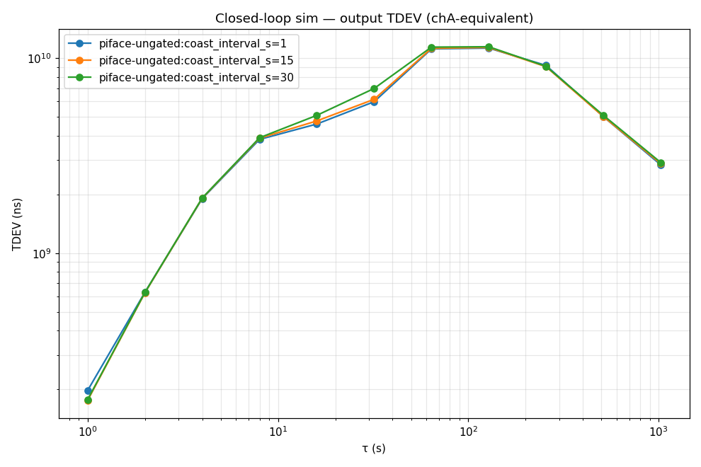

# Closed-loop DO/GNSS servo simulator

`scripts/peppar_fix/servo_sim.py` (library) + `scripts/servo_sim.py`
(CLI).  A deterministic, closed-loop test bed for servo / gate / fusion
design, so we stop discovering regressions on lab hardware overnight.
Inspired by SatPulse 0.2, which built the same thing for the same reason
([writeup](https://satpulse.net/2026/05/05/evolving-a-new-phc-synchronization-architecture-for-satpulse-0.2.html)).

Dayplan item: `closedLoopServoSim` (proposed 2026-05-28, owner charlie).

## Why closed-loop, not replay

`validate_ocxo_gate_phase4.py` *replays* recorded `innov_ticc` through a
fresh filter.  It can tell you which epochs a gate would flip, but it
**cannot** show loop dynamics — the recorded innovations don't change in
response to the servo's corrections.  Acquisition, gate over-rejection,
ringing, and coast wander are all closed-loop phenomena.

This sim carries a **ground-truth oscillator state** whose emitted
measurements RESPOND to the servo's commanded `adjfine` each epoch.  The
servo is the **real** `DOFreqEst` (its EKF, six arms, chi² gate) and the
**real** `OcxoTrustedGate`.  The only new code is the *plant* (truth
evolution + measurement emission) and the loop wiring them together.  A
servo change that would break hardware breaks the sim the same way.

## Architecture

```
        ┌─────────────────────── plant (new code) ───────────────────────┐
        │  TruthState: φ_rx, f_rx, φ_do, f_do  (ns, ppb)                  │
        │    rx TCXO: white PM + white/RW FM                              │
        │    DO: white FM (sets floor) + RW-FM + aging + servo response   │
        │  sensors emit (with noise):                                     │
        │    PPP  dt_rx = φ_rx + N(0,0.1ns)                               │
        │    TICC      = -φ_do - qerr(φ_rx + PPS_jitter) + N(0,60ps)      │
        │    EXTINT    = φ_do quantized to 8 ns                           │
        └───────────────┬──────────────────────────▲────────────────────┘
            measurements │                          │ adjfine (hardware)
                         ▼                          │  = -update() return
              ┌──────────────────────── real servo ─┴──────────┐
              │  DOFreqEst.update(...) → OcxoTrustedGate → LQR  │
              └────────────────────────────────────────────────┘
```

### Sign convention (the part that bites)

The hardware `adjfine` is the **negated** return of `update()`:
`peppar_fix_engine.py:8148` does `adjfine_ppb = -servo.update(...)`.
The plant steps `φ_do += -(f_do + adjfine) · dt`, matching DOFreqEst's
predict `φ_do -= (f_do + adjfine)·dt`.  Applying the raw (un-negated)
return makes the loop positive-feedback and diverge — that was the first
bug found bringing this up.

### Error models

| Source | Model | Default |
|---|---|---|
| DO short-τ floor | white FM (random-walk phase) | calibrated to per-host TDEV(1s): clkPoC3 45 ps, PiFace 54 ps |
| DO drift | constant `do_f0_ppb` + RW-FM + aging | clkPoC3 +21, PiFace −135 ppb (from x3 in captures) |
| rx TCXO / GNSS PPS | white PM + FM; **PPS-edge jitter ~2.3 ns** applied before the 8 ns tick | the jitter is invisible to PPP → ns-scale TICC innovations |
| TICC | 60 ps quantization | `sigma_ticc_ns=0.060` |
| EXTINT | ~8 ns quantization | `sigma_extint_ns=8.0` |
| Actuator | adjfine LSB quantization (commanded−applied residual) | `adjfine_lsb_ppb=0` (i226 = 0.073) |

The PPS-edge-jitter detail is load-bearing: it is why real TICC
innovations are **ns-scale-median even with PPP fed** (day0527 captures:
clkPoC3 median 3.4 ns, PiFace 2.2 ns — not 60 ps), and therefore why the
OCXO gate (threshold ~0.5 ns) starves a TICC-only loop.

## Faithfulness — what reproduces, what's approximate

The dayplan bar: *"reproduce known empirical results before we trust it
for new designs."*  Honest status (run `servo_sim.py --faithfulness`):

| Behavior | Empirical | Sim | Status |
|---|---|---|---|
| DO free-run floor | clkPoC3 45 ps, PiFace 54 ps | 45 / 54 ps | ✅ exact (calibrated) |
| TICC innovation median (PPP fed) | clkPoC3 3.4 ns, PiFace 2.2 ns | ~3 ns | ✅ matches |
| Clean-input lock | locks | locks, bounded | ✅ |
| OCXO gate starves TICC-only loop | clkPoC3 gated never-locks | never-locks (NOT-LOCKED) | ✅ mechanism |
| Gate + non-TICC x[2] carrier survives | PiFace v1 locks | locks | ✅ mechanism |
| Coast → long-τ hump | PiFace 6.4 ns @ 64 s | ~11 ns @ 64 s @ coast 30 s | ◑ right shape, ~2× high |
| Overconfidence divergence on long coast | (the failure longTauGnssCoupling fixes) | diverges at coast ≥ 60 s | ✅ reproduced |
| Exact lock TDEV(1s) | clkPoC3 104, PiFace v1 74 ps | ~130 / ~235 ps | ✗ ~2× off |

**What the v1 sim does NOT yet match, and why:** the exact lock-quality
numbers (104 / 74 / 565 ps) are dominated by effects modeled only
approximately here — the **adaptive coast scheduler** (`DisciplineScheduler`,
not yet wired; the per-epoch corrections of v1 under-represent coast
degradation) and the **fat-tailed real innovations** (multipath, cycle
slips, tick-straddle) that this v1 approximates with a Gaussian PPS
jitter.  Wiring the real scheduler + a fat-tail innovation model is the
next increment — and it is exactly the test bed bravo needs for
`longTauGnssCoupling` (sweep coast-cap / bandwidth deterministically).

### Scope — what the sim cannot tell you

The plant and the filter **import the same** `_qerr`/tick model
(`peppar_fix.do_freq_est._qerr`).  That is deliberate — it keeps the
loop self-consistent — but it means the sim validates the loop
**dynamics** faithfully and **cannot reveal a bug in the qerr/tick
measurement model itself**: if that model were wrong, plant and filter
would be wrong together and the loop would still close.  Hardware and
the recorded captures remain the truth for measurement-model
correctness.  `run_two_clock` **is now faithful** (2026-07-05, I-084500):
two fully INDEPENDENT sims with independent seeds, per
`two-site-sync-budget.md` §2 (on a shared antenna the rx TCXO, DO
free-running noise, and loop noise are all independent — only sky-side
terms cancel, and the sim injects no sky-side term).  σ²_Δ ≈ σ²_clock,A +
σ²_clock,B.  Use `two_clock_excursion_stats` for the settled p50/p95/max —
the p95 is the moonshot acceptance metric.  (The old `share_gnss` reseed —
which shared the DO noise and desynced — is removed; passing it warns.)
See [mid-tau-hump-servo-sim-2026-07-05.md](mid-tau-hump-servo-sim-2026-07-05.md).

## Findings the sim already surfaces

1. **The OCXO gate only gates Arm 4 (TICC).**  Whether a gated host
   locks turns entirely on whether `x[2]` (DO phase) has a *non-TICC*
   carrier (EXTINT).  clkPoC3-gated (TICC-primary) starves; PiFace-v1
   (EXTINT carries x[2]) locks.  Direct support for `disciplineModeFsm`'s
   mode-keyed gating: gate TICC in tracking, but keep an x[2] fallback.
2. **Long coasts diverge on the current EKF** because √P[3,3] shrinks
   (the filter gets confident) while x[3] — the *hidden* DO-frequency
   state, observable only through the integrator coupling — stays
   biased.  This is the `longTauGnssCoupling` overconfidence problem,
   reproduced deterministically.  A coast-cap keyed on a Q-from-char
   √P[3,3] (its fix #2) is the thing to validate here next.

## CLI

```sh
scripts/servo_sim.py --preset clkpoc3                 # one run + TDEV table
scripts/servo_sim.py --faithfulness                   # the bar + verdicts
scripts/servo_sim.py --preset piface-ungated \
    --sweep coast_interval_s=1,30,60,100              # coast hump / divergence
scripts/servo_sim.py --preset piface-v1 \
    --sweep gate_k_sigma=5,10,20,50                   # gate K sweep
scripts/servo_sim.py --two-clock clkpoc3 piface-v1    # cross-host |Δ| bound
scripts/servo_sim.py --preset clkpoc3 \
    --set adjfine_lsb_ppb=0.073 --out /tmp/run.csv --plot /tmp/tdev.png
```

Presets: `clkpoc3`, `clkpoc3-gated`, `piface-ungated`, `piface-v1`.
Any `SimConfig` field is overridable with `--set field=value` or sweepable
with `--sweep field=v1,v2,...`.



## Next increments

1. Wire the real `DisciplineScheduler` (adaptive coast) so coast behavior
   is faithful, not a fixed interval — unblocks `longTauGnssCoupling`
   coast-cap validation.
2. Fat-tailed innovation model (multipath / slip / tick-straddle) to
   recover the ungated 565 ps degradation and the gate's 565→74 ps win.
3. True shared-realization two-clock (currently copies rx state + reseeds)
   for a faithful cross-host 1 ns excursion-bound test (`crossHostSyncCapture`).
4. A/B harness for `routedQErrArm` once it lands.
