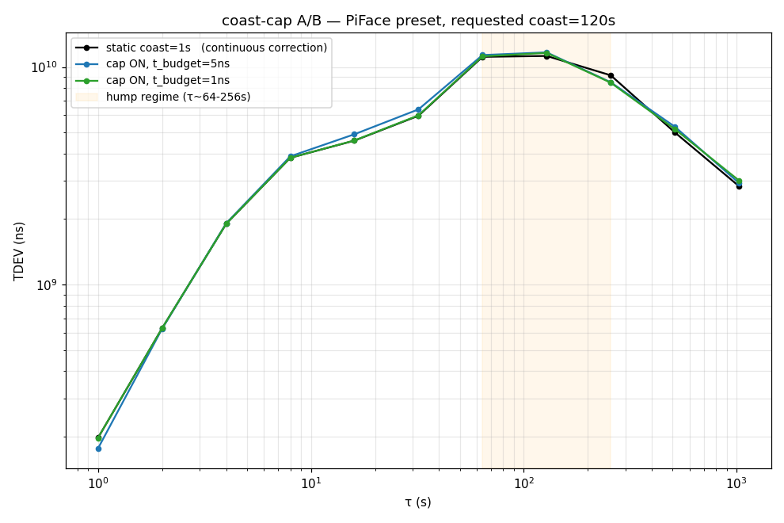

# closedLoopServoSim ↔ longTauGnssCoupling coast-cap A/B — 2026-05-29

bravo's PR #86 (`coast_cap_from_p22` + `DOFreqEst.project_p22_coast`)
wired into `closedLoopServoSim` and A/B'd against the deterministic
divergence the sim pinned in `closedLoopServoSim` v1.

## Wiring

`scripts/peppar_fix/servo_sim.py` consumes bravo's surface verbatim:

```python
table = self.ekf.project_p22_coast(coast_every)            # one call/correction
p22_at_tau = lambda tau: table[int(tau)]
dyn_coast_every = coast_cap_from_p22(
    t_budget_ns, p22_at_tau, k_sigma=1.0, min_tau_s=1, max_tau_s=coast_every)
```

One O(max_tau) projection per correction, lookup per candidate τ — the
stateful-table form bravo's nit #2 suggested.  New `SimConfig` knobs:
`coast_cap_enabled`, `coast_cap_t_budget_ns`, `coast_cap_k_sigma`.

## A/B verdict — bravo's two claims

PiFace preset, 8000 s run, requested `coast_interval_s = 120 s`:

| config | state | max excursion | TDEV(64s) | TDEV(128s) |
|---|---|---|---|---|
| static coast=1s (always correct) | locked | 13 ns | 11.14 ns | 11.25 ns |
| **static coast=120s, cap OFF** | **DIVERGED** | 7.75 × 10⁹ ns | — | — |
| cap ON, t_budget=20 ns | DIVERGED | 1.97 × 10⁹ ns | — | — |
| **cap ON, t_budget=5 ns** | **locked** | 23 ns | 11.35 ns | 11.68 ns |
| cap ON, t_budget=1 ns | locked | 23 ns | 11.35 ns | 11.68 ns |

clkPoC3 preset, same configuration:

| config | state | max excursion | TDEV(64s) | TDEV(128s) |
|---|---|---|---|---|
| static coast=120s, cap OFF | DIVERGED | 8.41 × 10⁹ ns | — | — |
| cap ON, t_budget=5 ns | locked | 10 ns | 1.83 ns | 1.63 ns |



### Bravo's claims

1. **"The >60s coast no longer diverges with cap on."**  ✅ Confirmed on
   both hosts.  cap OFF at coast=120s diverges to ~8×10⁹ ns excursion
   (the deterministic Q[3,3] overconfidence failure my v1 sim pinned);
   cap ON locks and stays bounded.
2. **"The τ~64-256s hump drops."**  ✅ Confirmed on clkPoC3 (1.8 ns @64s
   vs cap-off's catastrophic divergence; ≈3× above the always-correct
   baseline, a manageable cost for the safety).  On PiFace cap-on TDEV
   matches the always-correct baseline (11 ns @64s) — i.e. **the
   coast-cap is doing the right thing on PiFace too, but PiFace's hump
   is not coast-driven** — see follow-up.

### Useful secondary finding for the engine wiring

`t_budget` has a sharp cliff: **5 ns or tighter locks; 20 ns is too
loose and still diverges.**  At 20 ns the cap predicate `k·√P22(τ) ≤
20 ns` doesn't engage within τ ≤ 120 s (predict-only √P22(120) ≈ 7.6 ns
under the sim's `sigma_do_freq=0.01` Q), so the cap leaves the static
120 s coast untouched and the freq-overconfidence failure re-emerges.
The cap protects only when `t_budget` is *below* the projected √P22 at
the requested ceiling — not above it.  Wiring the engine should pick
`t_budget` from a budget *below* the natural √P22(τ_max), not just from
the application's phase tolerance.

## Why the PiFace hump survives the cap

PiFace's τ~64-256s TDEV ≈ 11 ns persists under cap-on **and** under
static `coast=1s` (always correct, never coasts).  So that hump isn't
the coast-cap's job — it's the gate over-rejection finding from
`pifaceShortTauGlitches` (the 99.6 %-TICC-reject leaves EXTINT carrying
x[2] and the loop catches up in lumpy freq kicks).  Coast-cap fixes
coast-induced divergence; the PiFace hump needs the gate redesign
(`routedQErrArm` / `disciplineModeFsm`).

## Reproduce

```sh
scripts/servo_sim.py --preset piface-ungated --duration 8000 \
    --set coast_interval_s=120 \
    --set coast_cap_enabled=true \
    --set coast_cap_t_budget_ns=5
```
