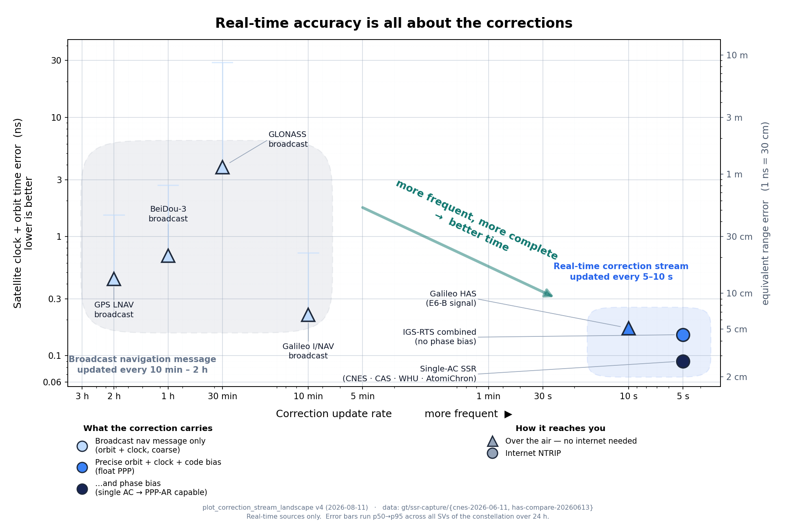

# Real-time accuracy is all about the corrections

Regenerate with `tools/plot_correction_stream_landscape.py` (writes the PNG for
docs/slides and an SVG for the web).  This note is the caption source: what each
number is, where it came from, and what it is *not*.

Companion to [`gnss-accuracy-ladder.md`](gnss-accuracy-ladder.md) (observation
time vs accuracy) and to the corrections deck at
`gt/nonssr-corrections/peppar-time-corrections-deck.pdf` (the *magnitude* of
each correction term).  This one plots the **sources**: how often each updates,
and how well it pins the satellite.

## The one message

A GNSS receiver's raw observations don't improve when you spend more on
corrections — they are what they are.  Everything separating a 100 ns consumer
fix from a sub-nanosecond disciplined clock lives in the *corrections* applied
on top: where the satellite really was, what its clock really read, and what
per-signal biases sit between the two.

The plot's good corner is **bottom-right**: frequent and accurate.  The eye
should travel down-and-right, from the broadcast navigation message to a
real-time correction stream — two orders of magnitude in freshness and one in
error, in a single step.

## Why two regions instead of one trend line

A fitted line through all seven points would assert something false.  **Within**
the broadcast tier, update rate is not what sets accuracy: Galileo updates
every 10 min and lands at 0.22 ns, GLONASS updates every 30 min and lands at
3.82 ns.  That 17× gap is the onboard frequency standard (Galileo passive
hydrogen maser vs GLONASS caesium) and the ground segment, not the update rate.

The effect that *is* real is **between** tiers — leaving the nav message for a
correction stream buys both freshness and completeness at once.  So the trend
is drawn as two soft regions and one arrow, which is the claim the data
supports.  Nothing connects individual points.

## The numbers

Broadcast-navigation-message error, per constellation.  From the 24 h CNES
`SSRA00CNE0` capture at `gt/ssr-capture/cnes-2026-06-11/` (8.8 M rows).  The
logic: **the correction an SSR stream supplies is the broadcast error it
removes**, so the SSR clock `c0` + radial orbit correction, detrended per SV,
*is* the error a receiver suffers without corrections.

| Constellation | update rate (ICD) | p50 | p95 |
|---|---|---|---|
| GLONASS | 30 min | **3.82 ns** | 28.8 ns |
| BeiDou-3 | 1 h | 0.69 ns | 2.70 ns |
| GPS LNAV | 2 h | 0.44 ns | 1.52 ns |
| Galileo I/NAV | 10 min | **0.22 ns** | 0.73 ns |

GLONASS is the coarse end — ~17× worse than Galileo at p50, ~40× at p95.
(Undetrended, GLONASS p50 is 7.8 ns and BeiDou 20.6 ns, but those carry a per-SV
datum offset the receiver clock absorbs; detrended is the honest "wander a
filter must chase" number.)

Update intervals, measured from the same captures plus
`gt/ssr-capture/has-compare-20260613/`:

| Source | updated every | phase bias? |
|---|---|---|
| CNES / CAS / WHU single-AC SSR | 5 s | **yes** — the PPP-AR gate |
| IGS-RTS combined (`SSRA03IGS0`) | 5 s | no |
| Galileo HAS SL1, E6-B signal | 10 s | no (Phase 1) |

The residual-error values for the three real-time streams are published figures
(HAS ≈ 0.17 ns satellite clock, per
[`galileo-has-research.md`](galileo-has-research.md)), not our measurements —
closing that gap needs the IGS-final residual run listed in
`project_ptbb_correction_stream_capture_20260722`.  The plot no longer marks
measured vs published, so keep that distinction in the prose if it matters to
the argument.

**AtomiChron** (Fugro's commercial service, and what the stock GNSSDO+/SXT-D
firmware uses) is named inside the single-AC point rather than given its own
marker: it belongs to that tier, and its cadence isn't published.

## What was deliberately left out

- **Post-processed IGS rapid/final products.**  Better than anything shown
  (~20 ps clocks), but 17 h to 2 weeks late — not options for a live clock.
  Scope is real-time only.
- **Code- and phase-bias update intervals** (measured at 610 s and 195 s on
  CNES).  They have an x but no y on this plot's measure — a bias isn't a
  residual clock+orbit error — so they could only appear as bare verticals.
  They belong in a "what a stream is made of" figure, not this one.  The real
  finding worth keeping: **clock is the only fast-moving correction**, which is
  exactly why SSR streams are engineered the way they are.
- **The 350 ps per-clock budget and the 53 ps measured floor.**  Both true (the
  floor is from the PTBB/BRUX known-good-obs runs), but they are *end-to-end
  receiver clock* quantities, whereas this plot's y is *per-satellite* error.
  Mixing them invited a wrong comparison.
- **Ionosphere and troposphere.**  Much larger terms (tens of ns) but handled by
  dual-frequency combination and in-filter estimation, not by a correction
  stream — see the deck's "corrections the F9T applies" slide.

## Caveats worth keeping in the caption

1. Broadcast y-values assume CNES ≈ truth — standard, and safe when the SSR
   residual is far below the broadcast error, but it is an assumption.
2. One 24 h window, one site.  Constellation error varies with geometry, upload
   schedule, and which satellites are up.
3. This is per-satellite clock+orbit error.  A receiver averages over many
   satellites, so its clock solution beats any single point here.
4. The x-values for the broadcast tiers are ICD ephemeris update rates;
   only the SSR and HAS intervals were measured.
