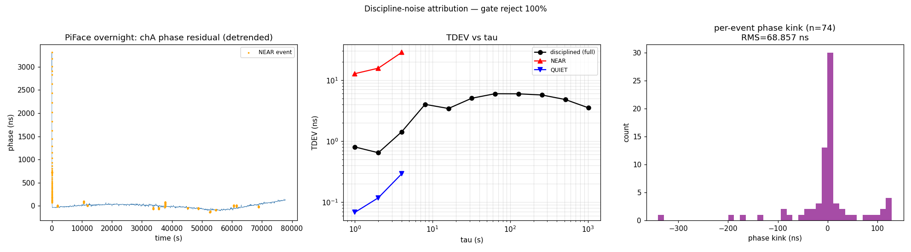

# PiFace short-tau TDEV glitches — attribution 2026-05-29

Dayplan item `pifaceShortTauGlitches` (owner charlie).  PiFace chA
TDEV(1s) is 66 ps in a clean 45-min window but ~0.94 ns over the 15.5 h
overnight — intermittent disturbances scattered through the night, while
MadHat stays clean (90 ps over 26 h).

**Verdict: discipline-injected actuation kicks, not the DO and not the
measurement chain.**  The degradation is 100 % localized to ~80 large
frequency-actuation events; between them PiFace sits at its floor.  This
rules out candidate (b) thermal (would be diffuse) and (d) measurement
outliers (would show in the quiet seconds too).  It is **not** primarily
candidate (a) coast-end either (only 9 % of kicks follow a coast).  It is
candidate (c): the OCXO gate rejecting ~all TICC, so the loop tracks
poorly and corrects in large sporadic jumps.

## Evidence

`scripts/analyze_discipline_noise.py` on the overnight pair
(`day0528-xhost-piface` ticc + arm-state, 21.6 h, 15412 servo updates),
events = `|Δx3| > 0.5 ppb` (the actuation kicks), ±8 s window:

```
                    TDEV(1s)     seconds
  NEAR (±8s of kick)  12.77 ns       305
  QUIET               0.068 ns    77565     ← PiFace's true floor
  ALL                 0.80 ns     77870     ← ≈ main's 0.94 ns overnight
  NEAR / QUIET ratio  = 188×  →  discipline INJECTS the short-tau noise
  per-event phase KINK: RMS 69 ns, |max| 341 ns
  per-event freq step:  RMS 52 ppb
```



QUIET = 68 ps ≈ the freerun floor (54 ps) + measurement — the DO and the
TICC chain are clean.  All the overnight excess lives in the 305 NEAR
seconds around 80 kicks.

## What the kicks are (and are not)

| property | value | reading |
|---|---|---|
| OCXO gate reject rate | **99.6 %** of TICC | the gate rejects almost all TICC obs |
| arms fed | ppp + qErr + extint(97%) + ticc, all epochs | x[2] runs on EXTINT; TICC is gated out |
| kicks after a coast (dt>30 s) | **9 %** | NOT a coast-end phenomenon |
| coast cadence | median 1 s, p95 13 s, max 151 s | mostly 1 Hz, occasional coasts |
| |Δx3| at kicks | up to **16.7 ppb** | large freq steps |
| innov_ticc near kicks | median 62 ns, max **479 ns** | the DO phase has drifted far |
| P22 at kicks | 28 → 34 ns² (spikes) | phase uncertainty blooms first |

Mechanism (candidate; the exact EKF pathway is servo-side — bravo):
because the gate rejects 99.6 % of TICC, the loop runs on EXTINT (8 ns
quantized) + qErr and cannot track the DO smoothly.  The DO phase
periodically drifts far (innov spikes to ~445 ns), and the loop catches
up with a large sporadic frequency kick (≤16.7 ppb) that kinks chA by up
to 341 ns.  The kicks are *not* clean accepted-obs updates — their
innovations (≤479 ns vs √S≈6 ns) would chi²-reject — so they are the
loop's catch-up response to accumulated drift, not a single bad
measurement.  Same family as the clkpoc3 gate-over-rejection finding:
an over-aggressive gate starves the carrier and the loop pays it back in
lumps.

This is the same v1 OCXO gate that closedLoopServoSim flagged: it gates
*only* TICC, so when TICC is the GNSS-PPS carrier and it is rejected
99.6 %, the loop is effectively running open between rare effective
corrections.

## Fixes

**Real fix — gate redesign (→ bravo's active servo work):**
- `routedQErrArm` (#79): a per-edge router that admits clean TICC (qErr-
  corrected or raw) instead of the gate rejecting 99.6 % wholesale would
  give the loop a continuous carrier and remove the starve-then-lump
  pattern.
- `disciplineModeFsm` / per-arm observability-aware gating: per main's
  own note, a near-sole carrier must not be de-weighted to starvation —
  for PiFace the TICC gate is doing exactly that.

**Cheap mitigation available now:** set `DOFreqEst.max_step_ppb` (the L3
per-epoch actuator rate limit, currently unset on PiFace) to clamp the
≤16.7 ppb kicks.  That bounds the per-event phase kink directly — a
band-aid that cuts the 341 ns kinks without touching the gate, useful
while the gate redesign lands.

## MadHat contrast confirms it is gate-rejection-driven

The clean reference host makes the case directly:

| host | OCXO gate reject | short-tau | kicks (|Δx3|>0.5 ppb) | max |Δx3| |
|---|---|---|---|---|
| **PiFace** (glitchy) | **99.6 %** | 0.94 ns / night | 80 / 15412 ep | 16.7 ppb |
| **MadHat** (clean) | **0.0 %** | 90 ps / 26 h | 20 / 3620 ep | 7.9 ppb |

Same engine, opposite gate behaviour.  MadHat with the gate effectively
off tracks the carrier continuously and stays at floor; PiFace with the
gate rejecting 99.6 % runs open between rare effective corrections, so it
drifts further and pays it back in larger lumps (16.7 vs 7.9 ppb max
kick).  The per-host kick *rate* is similar (~0.5 %), but PiFace's kicks
are bigger and land on a starved, further-drifted loop — which is why
only PiFace's short-tau degrades.  (Caveat: MadHat satfix2 ran gate-off
and is the range-starved OCXO-33; not a byte-identical config, but the
99.6 %-vs-0 % gate split is the load-bearing difference.)

This is the v1 OCXO gate's defining failure on a host whose TICC is the
GNSS-PPS carrier: it was tuned to reject measurement-noise punches, but
on PiFace it rejects essentially the whole carrier — the same
over-rejection that never-locked clkPoC3 under the gate, here showing up
as short-tau glitches rather than a failure to lock.
